# Sơ đồ UML & Mô tả Luồng Hoạt động
## Phân hệ Quản trị viên — EduMart

**Phiên bản:** 1.0 | **Ngày:** 20/06/2026  
**Phạm vi:** 6 phân hệ quản trị (Người dùng · Nhà cung cấp · Sản phẩm · Đơn hàng · Tài chính · Nội dung)  
**Định dạng:** Mermaid — render trong VS Code (Markdown Preview), GitHub, Obsidian

---

## Phần A — Tổng quan hệ thống

### A.1 Sơ đồ Use Case tổng quan

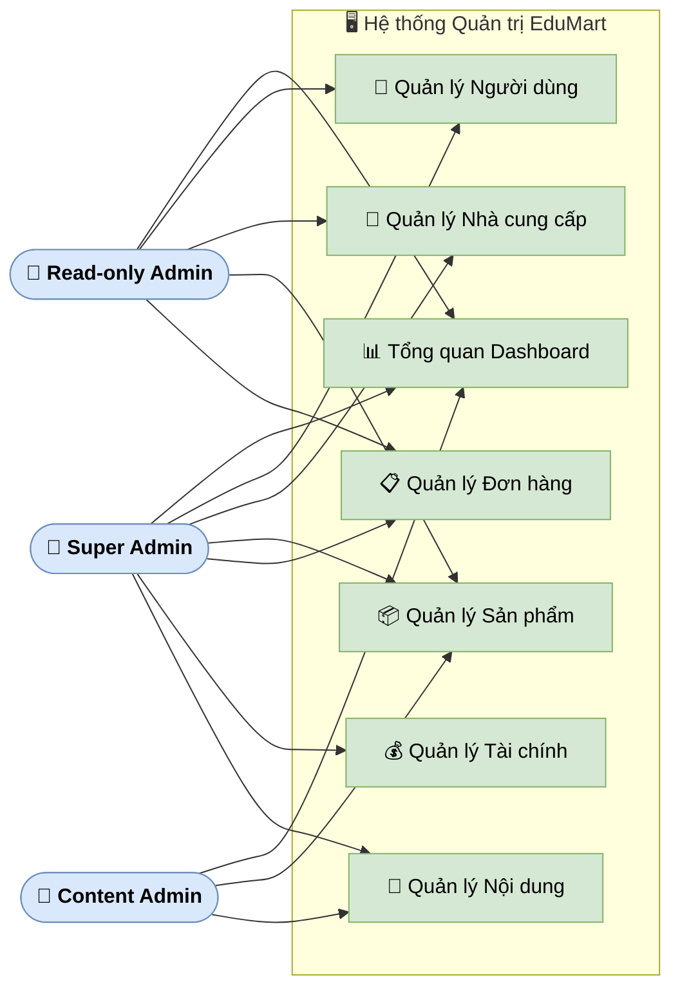

### A.2 Bảng phân quyền Actor

| Phân hệ | Super Admin | Content Admin | Read-only Admin |
|---------|:-----------:|:-------------:|:---------------:|
| Dashboard Tổng quan | ✅ Toàn quyền | ✅ Xem | ✅ Xem |
| Quản lý Người dùng | ✅ Toàn quyền | ❌ | ✅ Xem |
| Quản lý Nhà cung cấp | ✅ Toàn quyền | ❌ | ✅ Xem |
| Quản lý Sản phẩm | ✅ Toàn quyền | ✅ Duyệt, kiểm duyệt | ✅ Xem |
| Quản lý Đơn hàng | ✅ Toàn quyền | ❌ | ✅ Xem |
| Quản lý Tài chính | ✅ Toàn quyền | ❌ | ❌ |
| Quản lý Nội dung | ✅ Toàn quyền | ✅ Blog, Bình luận, Banner | ❌ |

---

## Phần B — Quản lý Người dùng

### B.1 Sơ đồ Use Case

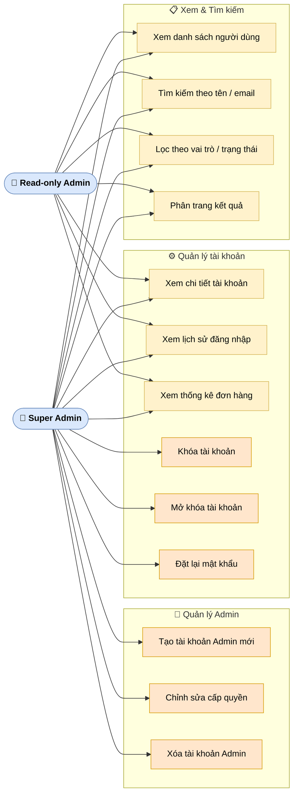

---

### B.2 Biểu đồ hoạt động: Khóa / Mở khóa tài khoản

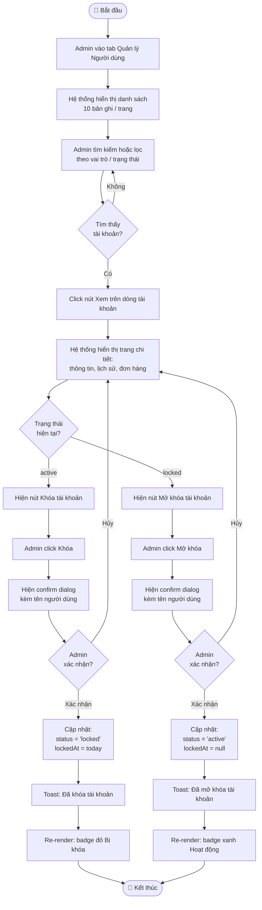

**Mô tả luồng:**

| Bước | Actor | Hành động | Kết quả |
|------|-------|-----------|---------|
| 1 | Admin | Truy cập Quản lý Người dùng | Danh sách 10 bản ghi/trang hiển thị |
| 2 | Admin | Tìm kiếm / lọc theo vai trò, trạng thái | Kết quả thu hẹp realtime |
| 3 | Admin | Click "Xem" trên dòng tài khoản cần xử lý | Trang chi tiết mở |
| 4 | Hệ thống | Kiểm tra `status` tài khoản | Hiện nút phù hợp (Khóa / Mở khóa) |
| 5 | Admin | Click nút Khóa / Mở khóa | Confirm dialog xuất hiện |
| 6a | Admin | Hủy confirm | Không thay đổi, quay về chi tiết |
| 6b | Admin | Xác nhận | Hệ thống cập nhật `status`, `lockedAt` |
| 7 | Hệ thống | Gọi `saveUsers()`, re-render | Toast xác nhận + badge cập nhật |

---

### B.3 Biểu đồ hoạt động: Tạo tài khoản Admin mới

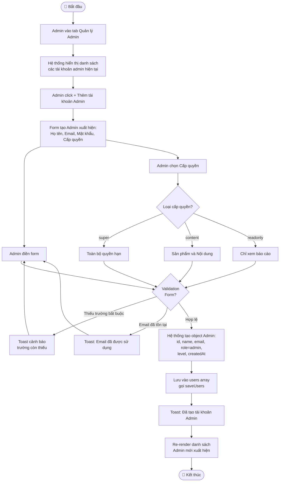

**Mô tả luồng:**

| Bước | Actor | Hành động | Kết quả |
|------|-------|-----------|---------|
| 1 | Admin | Mở tab Quản lý Admin | Danh sách admin hiện tại |
| 2 | Admin | Click "+ Thêm tài khoản Admin" | Form tạo mới xuất hiện |
| 3 | Admin | Điền Họ tên, Email, Mật khẩu | — |
| 4 | Admin | Chọn Cấp quyền (super/content/readonly) | Quyết định phạm vi truy cập |
| 5 | Hệ thống | Validate: trường bắt buộc, email unique | Toast cảnh báo nếu lỗi |
| 6 | Hệ thống | Tạo object, lưu, re-render | Toast xác nhận, admin mới trong danh sách |

---

## Phần C — Quản lý Nhà cung cấp

### C.1 Sơ đồ Use Case

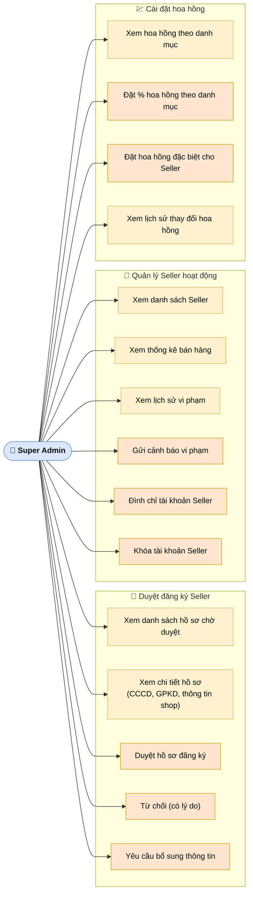

---

### C.2 Biểu đồ hoạt động: Duyệt đăng ký Seller

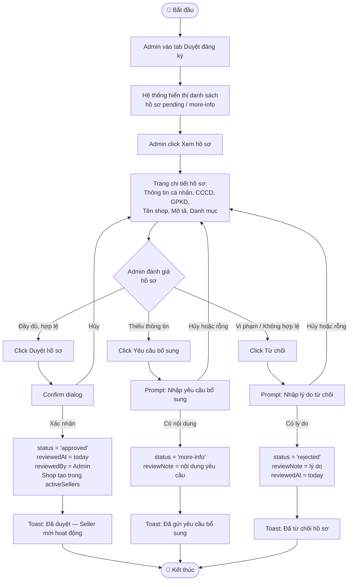

**Mô tả luồng:**

| Bước | Actor | Hành động | Kết quả |
|------|-------|-----------|---------|
| 1 | Admin | Vào tab Duyệt đăng ký | Danh sách hồ sơ `pending` + `more-info` |
| 2 | Admin | Click "Xem hồ sơ" | Trang chi tiết CCCD, GPKD, thông tin shop |
| 3a | Admin | Duyệt | Confirm → `status='approved'`, tạo shop trong `activeSellers` |
| 3b | Admin | Yêu cầu bổ sung | Prompt lý do → `status='more-info'`, banner xanh xuất hiện |
| 3c | Admin | Từ chối | Prompt lý do (bắt buộc) → `status='rejected'`, banner đỏ |
| 4 | Hệ thống | Lưu và re-render | Toast + badge cập nhật |

---

### C.3 Biểu đồ hoạt động: Xử lý vi phạm Seller (Cảnh báo → Đình chỉ → Khóa)

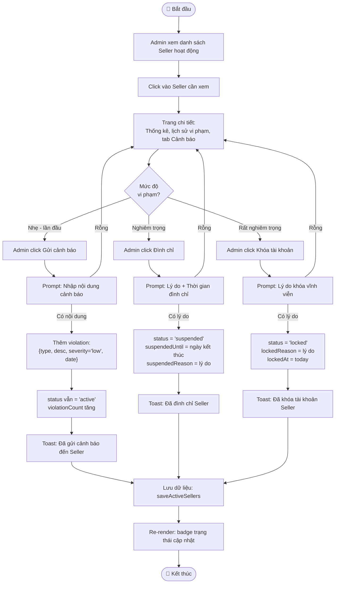

**Mô tả luồng:**

| Bước | Hành động | Trạng thái Seller | Mức độ |
|------|-----------|-------------------|--------|
| Cảnh báo | Ghi vi phạm, `violationCount++` | Vẫn `active` | Nhẹ |
| Đình chỉ | Set `suspended` + `suspendedUntil` | `suspended` | Vừa |
| Khóa | Set `locked` vĩnh viễn | `locked` | Nặng |
| Tất cả | Lý do bắt buộc, không được để rỗng | — | — |

---

## Phần D — Quản lý Sản phẩm

### D.1 Sơ đồ Use Case

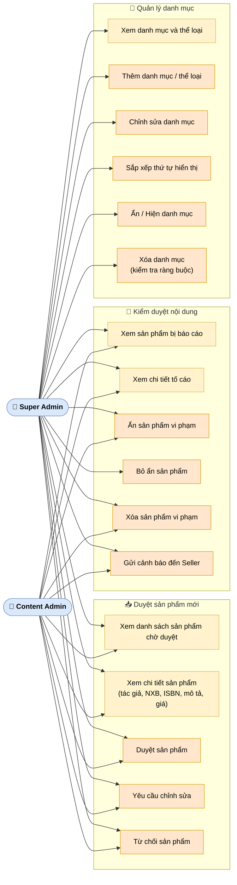

---

### D.2 Biểu đồ hoạt động: Duyệt sản phẩm mới

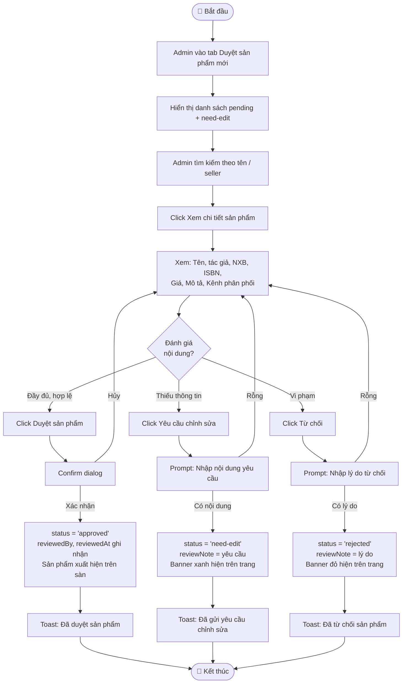

**Mô tả luồng:**

| Bước | Actor | Hành động | Điều kiện / Kết quả |
|------|-------|-----------|---------------------|
| 1 | Admin | Xem danh sách chờ duyệt | Badge đỏ số sản phẩm `pending` |
| 2 | Admin | Xem chi tiết sản phẩm | Đầy đủ: tác giả, NXB, ISBN, giá, kho, mô tả |
| 3a | Admin | Duyệt | Confirm → `approved`, sản phẩm lên sàn |
| 3b | Admin | Yêu cầu sửa | Prompt (bắt buộc) → `need-edit`, banner xanh; Seller được sửa và nộp lại |
| 3c | Admin | Từ chối | Prompt (bắt buộc) → `rejected`, banner đỏ; Seller không nộp lại |

---

### D.3 Biểu đồ hoạt động: Xử lý sản phẩm vi phạm

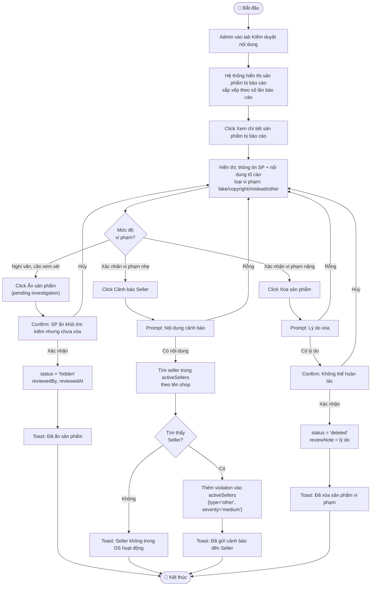

---

## Phần E — Quản lý Đơn hàng

### E.1 Sơ đồ Use Case

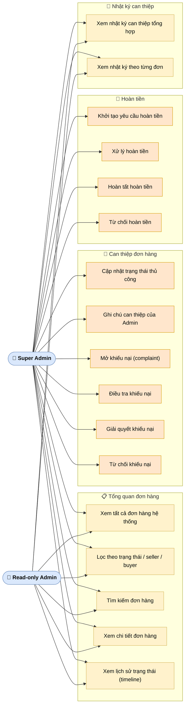

---

### E.2 Biểu đồ hoạt động: Xử lý khiếu nại đơn hàng

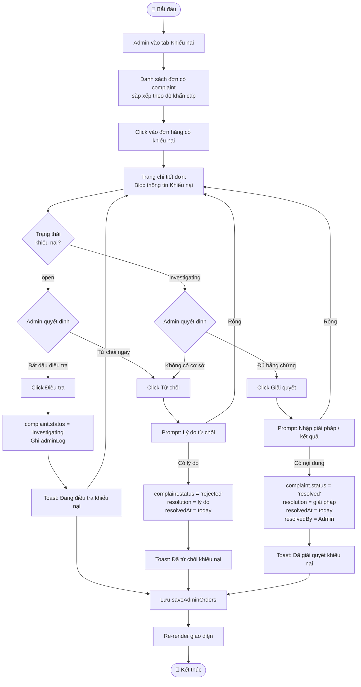

**Mô tả luồng:**

| Trạng thái khiếu nại | Hành động khả dụng | Kết quả |
|----------------------|-------------------|---------|
| `open` | Điều tra / Từ chối | Chuyển `investigating` hoặc `rejected` |
| `investigating` | Giải quyết / Từ chối | Chuyển `resolved` hoặc `rejected` |
| `resolved` / `rejected` | Không có | Chỉ xem |

---

### E.3 Biểu đồ hoạt động: Hoàn tiền (Refund)

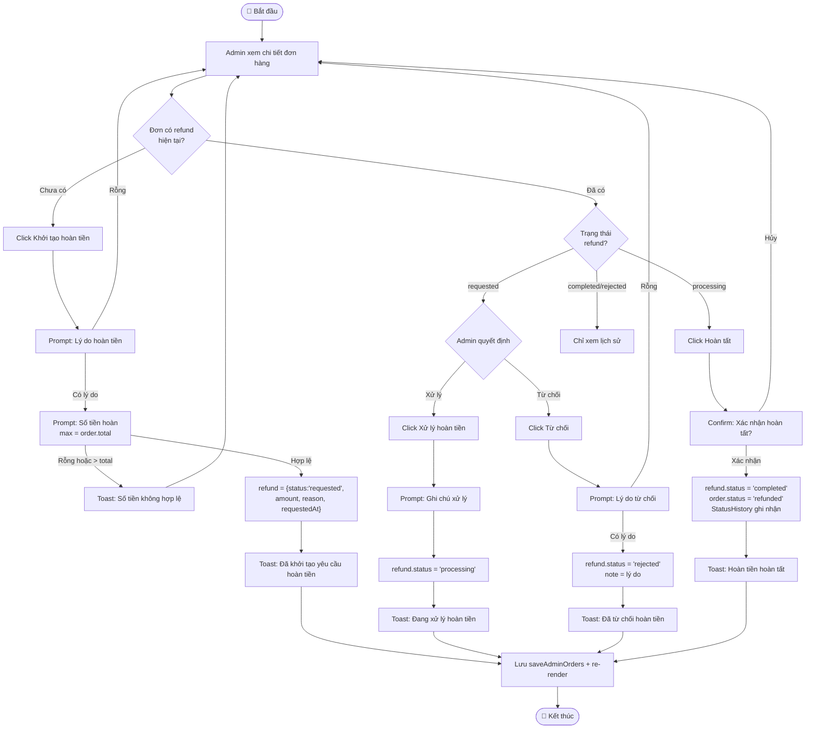

**Mô tả luồng trạng thái Refund:**

```
Không có  →  [Khởi tạo]  →  requested
requested  →  [Xử lý]    →  processing  →  [Hoàn tất]  →  completed
requested  →  [Từ chối]  →  rejected
processing →  [Hoàn tất] →  completed   +  order.status = 'refunded'
```

---

## Phần F — Quản lý Tài chính

### F.1 Sơ đồ Use Case

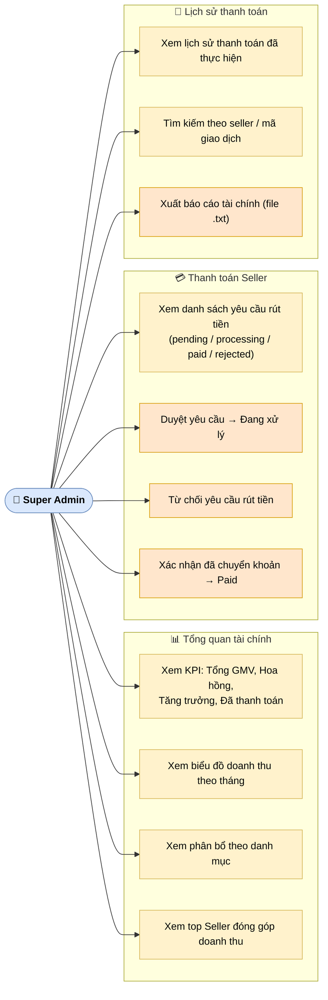

---

### F.2 Biểu đồ hoạt động: Xử lý yêu cầu rút tiền của Seller

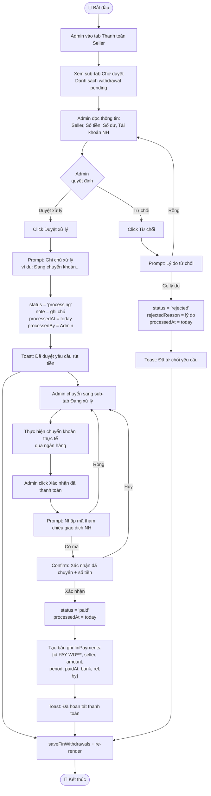

**Mô tả vòng đời yêu cầu rút tiền:**

```
pending  →  [Duyệt xử lý]         →  processing
pending  →  [Từ chối]              →  rejected
processing → [Xác nhận thanh toán] →  paid  →  Tạo bản ghi finPayments
```

---

### F.3 Biểu đồ hoạt động: Xuất báo cáo tài chính

```mermaid
flowchart TD
    S([🔵 Bắt đầu]) --> A[Admin vào tab Lịch sử thanh toán]
    A --> B[Xem danh sách tất cả giao dịch\nVà tổng số tiền đã thanh toán]
    B --> C[Admin tìm kiếm / lọc nếu cần]
    C --> D[Admin click Xuất báo cáo]
    D --> E[Hệ thống tổng hợp dữ liệu]
    E --> F["Tạo nội dung báo cáo .txt:\n• Tiêu đề + ngày xuất\n• Tổng quan 6 tháng (GMV + Hoa hồng)\n• Phân bổ theo danh mục\n• Lịch sử thanh toán từng giao dịch\n• Trạng thái yêu cầu rút tiền"]
    F --> G["Tạo Blob URL:\nnew Blob(content, 'text/plain')\nURL.createObjectURL(blob)"]
    G --> H[Tạo thẻ a, click() tự động\ntải file bao-cao-tai-chinh-edumart.txt]
    H --> I[URL.revokeObjectURL để giải phóng bộ nhớ]
    I --> J[Toast: Đã xuất báo cáo tài chính]
    J --> Z([🔴 Kết thúc])
```

---

## Phần G — Quản lý Nội dung

### G.1 Sơ đồ Use Case

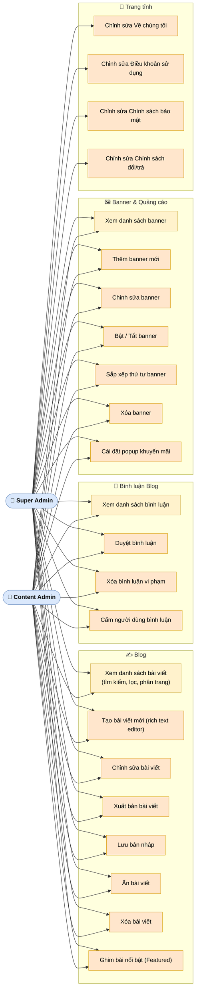

---

### G.2 Biểu đồ hoạt động: Viết & Xuất bản bài viết Blog

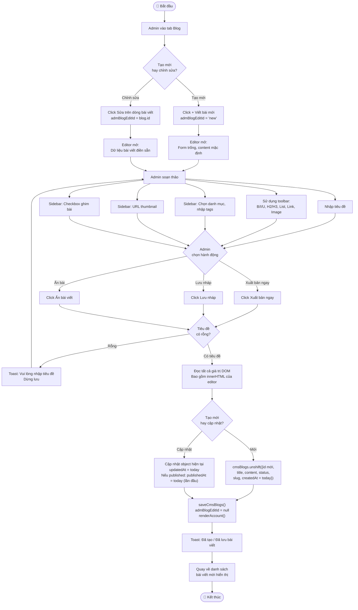

**Mô tả luồng soạn thảo:**

| Công cụ toolbar | Hành động | Kết quả |
|----------------|-----------|---------|
| **B / I / U** | Chọn text → click | `execCommand('bold'/'italic'/'underline')` |
| **H2 / H3** | Đặt con trỏ → click | `execCommand('formatBlock', 'H2'/'H3')` |
| **≡ / 1.** | Click | `execCommand('insertUnorderedList'/'insertOrderedList')` |
| **🔗** | Click → Prompt URL | `execCommand('createLink', url)` |
| **🖼** | Click → Prompt URL | `execCommand('insertImage', url)` |

**Lưu ý quan trọng:** Editor `contenteditable` **không** gọi `renderAccount()` trong quá trình soạn thảo — tránh mất nội dung chưa lưu.

---

### G.3 Biểu đồ hoạt động: Kiểm duyệt bình luận

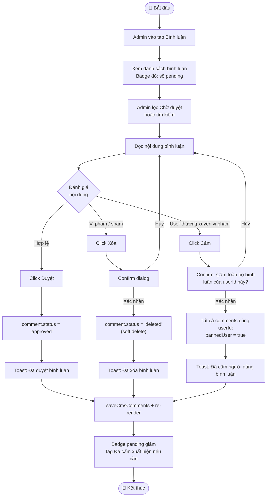

**Mô tả phạm vi lệnh Cấm:**

| Hành động | Phạm vi | Reversible? |
|-----------|---------|-------------|
| Xóa bình luận | Chỉ bình luận đang xét (`status='deleted'`) | Không (soft delete) |
| Cấm người dùng | **Tất cả** bình luận cùng `userId` (`bannedUser=true`) | Không (MVP) |
| Duyệt | Chỉ bình luận đang xét (`status='approved'`) | Không áp dụng |

---

### G.4 Biểu đồ hoạt động: Quản lý Banner & Popup

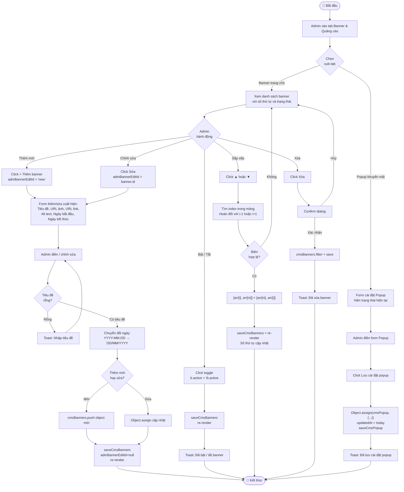

---

## Phần H — Tổng hợp trạng thái & chuyển đổi

### H.1 Sơ đồ trạng thái: Tài khoản Người dùng

```mermaid
stateDiagram-v2
    [*] --> active : Đăng ký thành công
    active --> locked : Admin khóa
    locked --> active : Admin mở khóa
    active --> deleted : Xóa mềm
    locked --> deleted : Xóa mềm
    deleted --> [*]
```

### H.2 Sơ đồ trạng thái: Hồ sơ Seller

```mermaid
stateDiagram-v2
    [*] --> pending : Seller nộp hồ sơ
    pending --> more_info : Yêu cầu bổ sung
    more_info --> pending : Seller bổ sung và nộp lại
    pending --> approved : Admin duyệt
    pending --> rejected : Admin từ chối
    approved --> suspended : Vi phạm nghiêm trọng
    approved --> locked : Vi phạm rất nghiêm trọng
    suspended --> approved : Hết thời gian đình chỉ
    suspended --> locked : Vi phạm tiếp theo
```

### H.3 Sơ đồ trạng thái: Sản phẩm chờ duyệt

```mermaid
stateDiagram-v2
    [*] --> pending : Seller đăng sản phẩm
    pending --> need_edit : Yêu cầu chỉnh sửa
    need_edit --> pending : Seller sửa và nộp lại
    pending --> approved : Admin duyệt
    need_edit --> approved : Admin duyệt sau khi sửa
    pending --> rejected : Admin từ chối
    need_edit --> rejected : Admin từ chối
```

### H.4 Sơ đồ trạng thái: Đơn hàng & Hoàn tiền

```mermaid
stateDiagram-v2
    direction LR
    [*] --> pending : Người mua đặt
    pending --> confirmed : Seller xác nhận
    confirmed --> processing : Đang chuẩn bị
    processing --> shipping : Đang giao
    shipping --> delivered : Đã giao
    delivered --> completed : Người mua xác nhận
    pending --> cancelled : Hủy đơn
    confirmed --> cancelled : Hủy đơn
    delivered --> refunded : Hoàn tiền thành công
    completed --> refunded : Hoàn tiền sau nhận hàng
```

### H.5 Sơ đồ trạng thái: Yêu cầu rút tiền Seller

```mermaid
stateDiagram-v2
    [*] --> pending : Seller gửi yêu cầu
    pending --> processing : Admin duyệt
    pending --> rejected : Admin từ chối
    processing --> paid : Admin xác nhận đã chuyển khoản
```

### H.6 Sơ đồ trạng thái: Bài viết Blog

```mermaid
stateDiagram-v2
    [*] --> draft : Lưu nháp
    draft --> published : Xuất bản
    draft --> hidden : Ẩn
    published --> draft : Chuyển về nháp
    published --> hidden : Ẩn bài
    hidden --> published : Xuất bản lại
    hidden --> draft : Chuyển về nháp
    published --> [*] : Xóa bài
    draft --> [*] : Xóa bài
    hidden --> [*] : Xóa bài
```

---

## Phần I — Ma trận chức năng & trạng thái

### I.1 Điều kiện hiển thị nút hành động theo trạng thái

**Đơn hàng — Complaint:**

| Trạng thái complaint | Điều tra | Giải quyết | Từ chối |
|---------------------|:--------:|:----------:|:-------:|
| `open` | ✅ | ❌ | ✅ |
| `investigating` | ❌ | ✅ | ✅ |
| `resolved` | ❌ | ❌ | ❌ |
| `rejected` | ❌ | ❌ | ❌ |

**Đơn hàng — Refund:**

| Trạng thái refund | Xử lý | Hoàn tất | Từ chối |
|------------------|:-----:|:--------:|:-------:|
| `requested` | ✅ | ❌ | ✅ |
| `processing` | ❌ | ✅ | ❌ |
| `completed` | ❌ | ❌ | ❌ |
| `rejected` | ❌ | ❌ | ❌ |

**Bình luận Blog:**

| Trạng thái | Duyệt | Xóa | Cấm user |
|-----------|:-----:|:---:|:--------:|
| `pending` | ✅ | ✅ | ✅ (nếu chưa cấm) |
| `approved` | ❌ | ✅ | ✅ (nếu chưa cấm) |
| `deleted` | ❌ | ❌ | ❌ |

**Yêu cầu rút tiền Seller:**

| Trạng thái | Duyệt xử lý | Xác nhận paid | Từ chối |
|-----------|:-----------:|:-------------:|:-------:|
| `pending` | ✅ | ❌ | ✅ |
| `processing` | ❌ | ✅ | ❌ |
| `paid` | ❌ | ❌ | ❌ |
| `rejected` | ❌ | ❌ | ❌ |

---

*Tài liệu này được tạo tự động từ phân tích mã nguồn `public/app.js` và các tài liệu yêu cầu trong thư mục `docs/`. Cập nhật cùng với mỗi sprint phát triển.*
